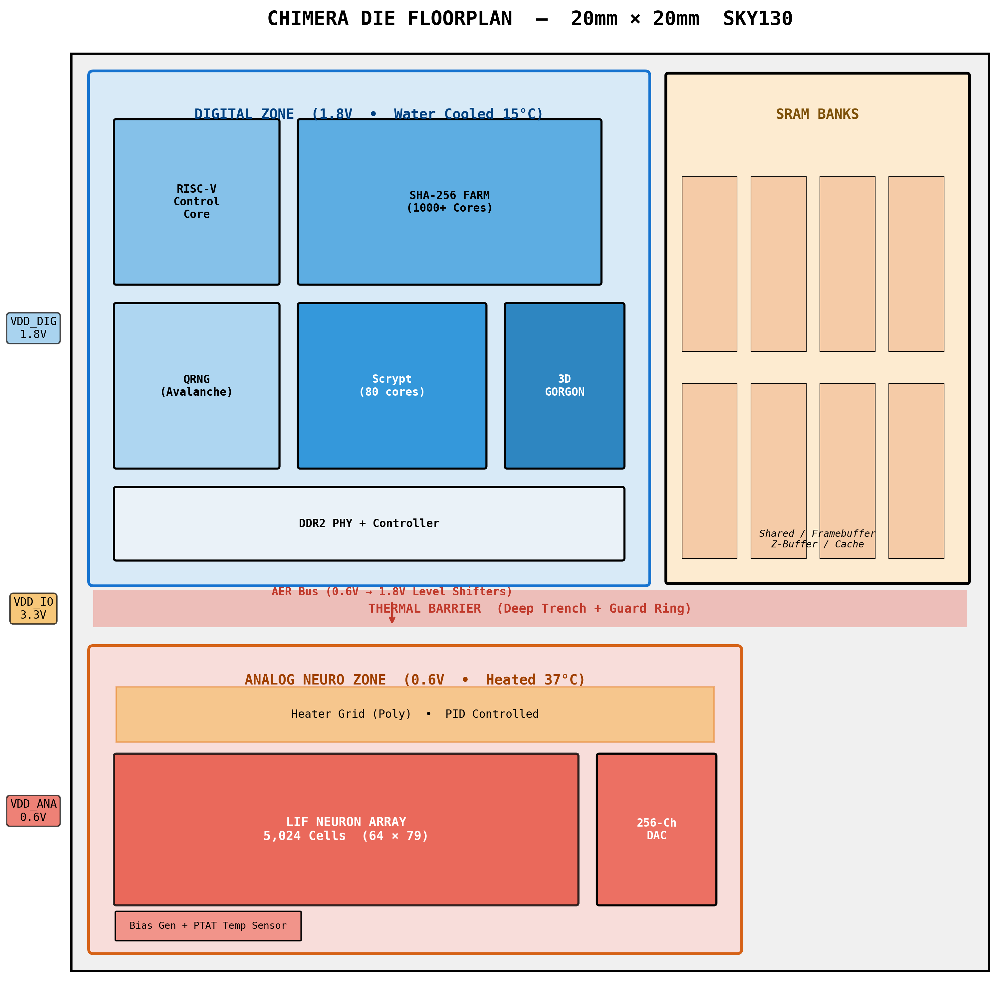
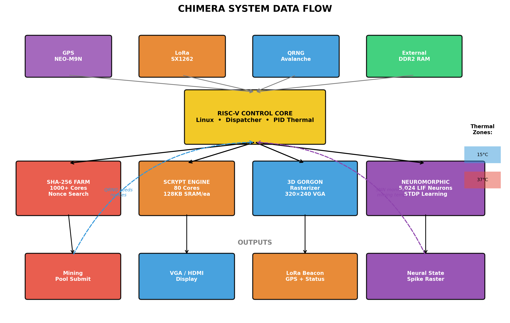

# chimera-silicon
Heterogeneous compute platform: neuromorphic, mining, graphics, entropy

  

<h1 align="center">CHIMERA</h1>

<i>A brain, an eye, a soul, ears, and a mouth — on open silicon.</i>

## What
One chip. 5,024 analog neurons. SHA-256 mining. 3D graphics. Quantum entropy. GPS. LoRa. Audio.

## Architecture

  

## Status
| Block | Status | Owner |
|-------|--------|-------|
| SHA-256 | In progress | @you |
| LIF Neuron | Needs review | @you |
| Gorgon 3D | Not started | *Unclaimed* |
| QRNG | Not started | *Unclaimed* |
| Audio | Not started | *Unclaimed* |
| GPS/LoRa | Not started | *Unclaimed* |

## Contribute
1. Open an issue saying "I'll take [block]"
2. Design it. Simulate it.
3. Open a pull request.

## License
- Hardware: CERN OHL-S
- Software: GPL-3.0

## Contact
Open an issue. Do not email.
